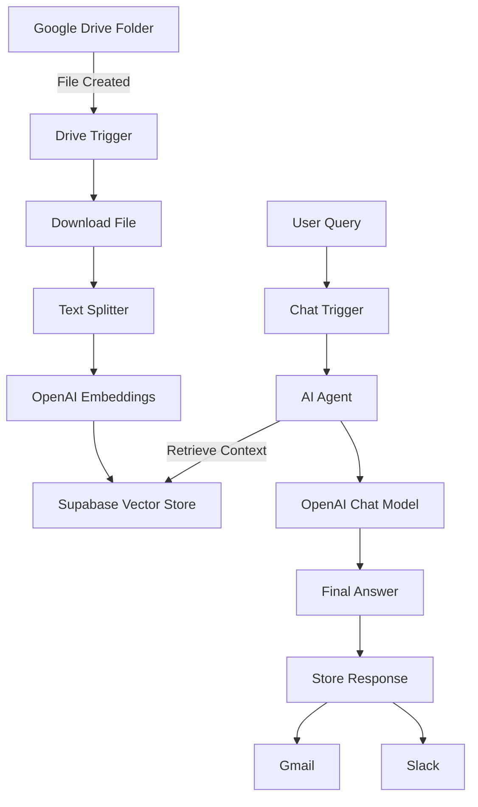

# n8n RAG Automation – Google Drive to Vector DB

Event-driven Retrieval-Augmented Generation (RAG) workflow built using n8n

### Overview

This project implements an automated RAG pipeline where:

Documents uploaded to Google Drive are detected every minute

Files are chunked and embedded

Stored in a vector database

Users can ask questions

Answers are delivered via Gmail and Slack

### End to end flow

🧠 Architecture Components Explained

1️⃣ Document Ingestion Layer

Google Drive Trigger watches a specific folder

Polls every minute for newly uploaded documents

Downloads files as binary data

2️⃣ Preprocessing & Embedding

Recursive Character Text Splitter

Chunk size: 3000

Overlap: 250

OpenAI Embeddings

Converts chunks into dense vectors

3️⃣ Vector Storage

Supabase Vector Store

Stores embeddings + metadata

Used both for indexing and retrieval

4️⃣ Agentic RAG Layer

LangChain AI Agent

Uses vector store as a tool

Maintains conversational memory

Dynamically decides when to retrieve context

5️⃣ LLM Reasoning

OpenAI GPT-4.1-Mini

Combines retrieved documents + user query

Generates grounded, contextual answers

6️⃣ Persistence & Delivery

Stores:

User question

AI-generated response

Delivers answers via:

📧 Gmail

💬 Slack

